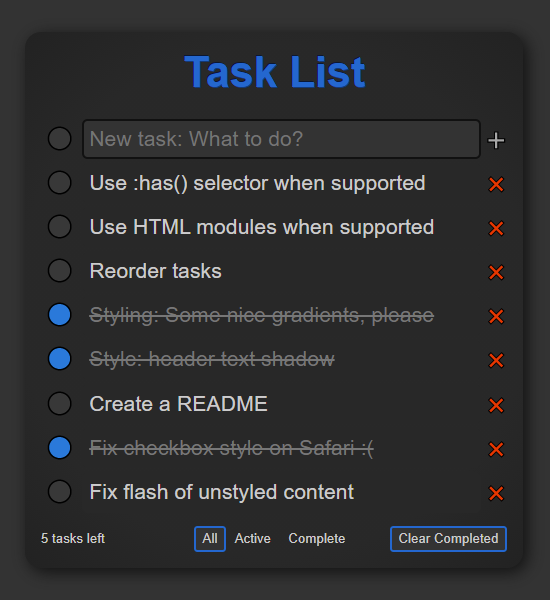
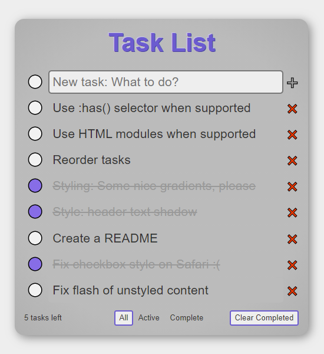

# Task-webapp

[Live demo](https://parasyte.github.io/task-webapp)

Many UI frameworks use a task list application example to illustrate how the framework is used. The idea is popular enough that there are entire projects dedicated to writing the same task list with multiple frameworks to better compare various UI frameworks.

This is the same kind of task list application, but it does not use any UI framework beyond what is provided by vanilla JavaScript, HTML, and CSS. It works on every major browser released since December 2023. The primary source code is under 5 KiB total (gzipped) with no dependencies or build system necessary.

This is mostly an example of the [KISS](https://en.wikipedia.org/wiki/KISS_principle) and [YAGNI](https://www.martinfowler.com/bliki/Yagni.html) principles at work. Build only what you need, and pay only the minimum cost required. It's also an example of the extreme difference between using a feature-rich framework like React and the bare minimum to get the job done.


## Screen shots

Supports dark mode and light mode themes.






## Size comparison (2025-10-05)

The Source Lines of Code counts were produced by [Tokei](https://github.com/XAMPPRocky/tokei) using the following commands to get an accurate count of all sources, including dependencies.

[`task-webapp`](https://github.com/parasyte/task-webapp/tree/24e6bc6c2b1999519c96e72c05bf08663cffee8f) (this project):

```bash
tokei -t CSS,HTML,JavaScript .
```

```text
===============================================================================
 Language            Files        Lines         Code     Comments       Blanks
===============================================================================
 CSS                     3          257          210           11           36
 JavaScript              4          187          131           22           34
-------------------------------------------------------------------------------
 HTML                    1           62           56            0            6
 |- HTML                 1            6            6            0            0
 (Total)                             68           62            0            6
===============================================================================
 Total                   8          506          397           33           76
===============================================================================
```

File sizes:

```bash
du -bch **/*.css **/*.js *.css *.html *.js
```

```text
905     components/task-item.css
2.4K    components/task-item.js
927     js/storage.js
155     js/utils.js
3.1K    index.css
1.2K    theme.css
2.8K    index.html
1.4K    index.js
13K     total
```

----

[`todomvc/examples/javascript-es5/dist`](https://github.com/tastejs/todomvc/tree/c8aedce5f512e47991a62b37b9ee3ef38df1a4b6/examples/javascript-es5/dist):

```bash
tokei -t CSS,HTML,JavaScript examples/javascript-es5/dist/
```

```text
===============================================================================
 Language            Files        Lines         Code     Comments       Blanks
===============================================================================
 CSS                     2          534          449            9           76
 HTML                    1           57           57            0            0
 JavaScript              8         1182          831          222          129
===============================================================================
 Total                  11         1773         1337          231          205
===============================================================================
```

File sizes:

```bash
du -abch examples/javascript-es5/dist/
```

```text
704     examples/javascript-es5/dist/app.js
2.0K    examples/javascript-es5/dist/base.css
7.4K    examples/javascript-es5/dist/base.js
8.1K    examples/javascript-es5/dist/controller.js
1.8K    examples/javascript-es5/dist/helpers.js
7.5K    examples/javascript-es5/dist/index.css
2.4K    examples/javascript-es5/dist/index.html
3.7K    examples/javascript-es5/dist/model.js
4.5K    examples/javascript-es5/dist/store.js
3.3K    examples/javascript-es5/dist/template.js
7.3K    examples/javascript-es5/dist/view.js
49K     examples/javascript-es5/dist/
49K     total
```

----

[`todomvc/examples/web-components`](https://github.com/tastejs/todomvc/tree/c8aedce5f512e47991a62b37b9ee3ef38df1a4b6/examples/web-components):

```bash
tokei -t CSS,HTML,JavaScript examples/web-components/dist/
```

```text
===============================================================================
 Language            Files        Lines         Code     Comments       Blanks
===============================================================================
 CSS                     4          282          238            6           38
 HTML                    1           31           29            1            1
 JavaScript             22         1640         1403           79          158
===============================================================================
 Total                  27         1953         1670           86          197
===============================================================================
```

File sizes:

```bash
du -abch examples/web-components/dist/
```

```text
7.4K    examples/web-components/dist/base.js
4.8K    examples/web-components/dist/components/todo-app/todo-app.component.js
354     examples/web-components/dist/components/todo-app/todo-app.template.js
5.2K    examples/web-components/dist/components/todo-app
2.5K    examples/web-components/dist/components/todo-bottombar/todo-bottombar.component.js
959     examples/web-components/dist/components/todo-bottombar/todo-bottombar.template.js
3.4K    examples/web-components/dist/components/todo-bottombar
6.5K    examples/web-components/dist/components/todo-item/todo-item.component.js
814     examples/web-components/dist/components/todo-item/todo-item.template.js
7.3K    examples/web-components/dist/components/todo-item
3.7K    examples/web-components/dist/components/todo-list/todo-list.component.js
203     examples/web-components/dist/components/todo-list/todo-list.template.js
3.9K    examples/web-components/dist/components/todo-list
3.9K    examples/web-components/dist/components/todo-topbar/todo-topbar.component.js
702     examples/web-components/dist/components/todo-topbar/todo-topbar.template.js
4.6K    examples/web-components/dist/components/todo-topbar
25K     examples/web-components/dist/components
514     examples/web-components/dist/hooks/useDoubleClick.js
524     examples/web-components/dist/hooks/useKeyListener.js
1.2K    examples/web-components/dist/hooks/useRouter.js
2.2K    examples/web-components/dist/hooks
1.6K    examples/web-components/dist/index.html
351     examples/web-components/dist/styles/app.constructable.js
2.0K    examples/web-components/dist/styles/base.css
3.1K    examples/web-components/dist/styles/bottombar.constructable.js
424     examples/web-components/dist/styles/footer.css
1.6K    examples/web-components/dist/styles/global.constructable.js
1.8K    examples/web-components/dist/styles/global.css
406     examples/web-components/dist/styles/header.css
189     examples/web-components/dist/styles/main.constructable.js
3.8K    examples/web-components/dist/styles/todo-item.constructable.js
282     examples/web-components/dist/styles/todo-list.constructable.js
1.7K    examples/web-components/dist/styles/topbar.constructable.js
16K     examples/web-components/dist/styles
2.0K    examples/web-components/dist/utils/nanoid.js
2.0K    examples/web-components/dist/utils
53K     examples/web-components/dist/
53K     total
```

----

The rest are built and minimized with webpack, making the line counts uninteresting. We compare the files sizes instead.

[`todomvc/examples/javascript-es6/dist`](https://github.com/tastejs/todomvc/tree/c8aedce5f512e47991a62b37b9ee3ef38df1a4b6/examples/javascript-es6/dist):

File sizes:

```bash
du -abch --exclude '*.map' examples/javascript-es6/dist/
```

```text
8.2K    examples/javascript-es6/dist/app.bundle.js
7.3K    examples/javascript-es6/dist/app.css
3.7K    examples/javascript-es6/dist/base.js
1.3K    examples/javascript-es6/dist/index.html
21K     examples/javascript-es6/dist/
21K     total
```

----

[`todomvc/examples/preact/dist`](https://github.com/tastejs/todomvc/tree/c8aedce5f512e47991a62b37b9ee3ef38df1a4b6/examples/preact/dist):

File sizes:

```bash
du -abch --exclude '*.map' examples/preact/dist/
```

```text
7.5K    examples/preact/dist/app.css
17K     examples/preact/dist/app.js
7.4K    examples/preact/dist/base.js
796     examples/preact/dist/index.html
32K     examples/preact/dist/
32K     total
```

----

[`todomvc/examples/react/dist`](https://github.com/tastejs/todomvc/tree/c8aedce5f512e47991a62b37b9ee3ef38df1a4b6/examples/react/dist):

File sizes:

```bash
du -abch --exclude '*.map' --exclude '*.txt' examples/react/dist/
```

```text
147K    examples/react/dist/app.bundle.js
7.3K    examples/react/dist/app.css
3.7K    examples/react/dist/base.js
645     examples/react/dist/index.html
159K    examples/react/dist/
159K    total
```

----

[`todomvc/examples/react-redux/dist`](https://github.com/tastejs/todomvc/tree/c8aedce5f512e47991a62b37b9ee3ef38df1a4b6/examples/react-redux/dist):

File sizes:

```bash
du -abch --exclude '*.map' --exclude '*.txt' examples/react-redux/dist/
```

```text
169K    examples/react-redux/dist/app.bundle.js
7.3K    examples/react-redux/dist/app.css
3.7K    examples/react-redux/dist/base.js
663     examples/react-redux/dist/index.html
181K    examples/react-redux/dist/
181K    total
```
